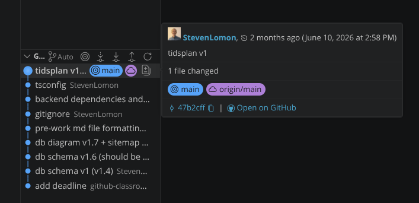
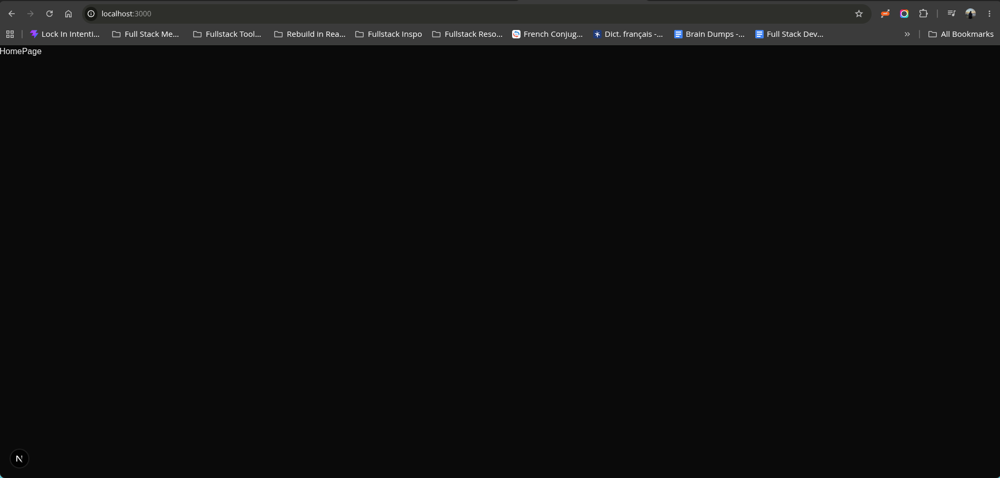
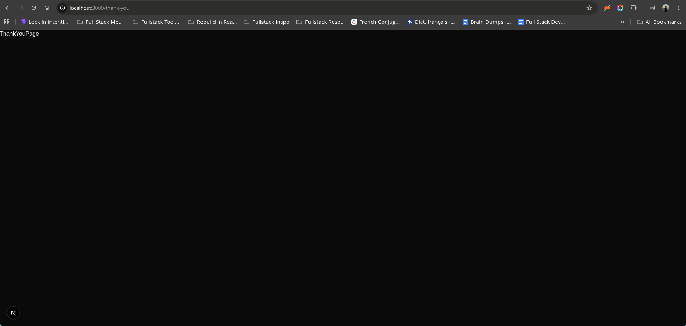
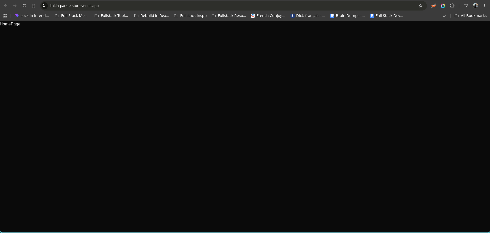

## Aug 20
Let's switch till svenska haha. Två månader sedan min senaste commit, wow:    


Vilket betyder att det idag den 20:e aug är ca 6 hela dagar till deadline tis den 25:e. Men jag har haft ett fantastiskt sommarlov. *Och*! Jag har byggt ett projekt jag är genuint stolt över i Florilegium: https://github.com/stevenlomon/florilegium.  
Mycket av det jag gör nu när jag kommer tillbaka till denna e-handel kommer ta från det jag lärt mig och byggt i Florilegium. Jag kommer köra Next.js! Så låt oss fixa upp scaffold nu.  
Jag har oxå läst hur mycket folk i klassen har blivit frustrerade med en Vercel som krånglar så prio idag är definitevt att komma underfund med Vercels CLI.  
Plan idag tor den 20:e aug:
* Skapa Next.js scaffold och få till sid arkitekturen med alla page.tsx och route.tsx på rätt ställe i fil routern.  
* Få upp det på Vercel via CLI  

Om jag bara kan få till dessa två idag kommer jag kunna sova gott inatt och fortsätta det momentum jag byggt imorgon. Allt annat jag gör idag är bonus och icing on the cake så att säga.  

Alright. Vi har scaffolding klar och.. kan jag göra så här? Hold up  
[sitemap](./pre-work.md#sitemap) LET'S GO. 
Och sitemap haha är översatt till App Router och page.tsx som vi kan navigera till:  



Let's översätta våra [API endpoints](./pre-work.md#endpoints) till route.ts filer i rätt ställe i mapp arkitekturen härnäst.  
Aight, jag vill säga att jag har the foundation för GET (GET all) och POST just nu. Inga /[id] endpoints men jag är honestly inte ens säker på ifall det är så jag har gjort i Florilegium. Så jag lämnar det lite öppet nu med avsikt att komma tillbaka och krystallisera den aspekten av /api.  Let's move on. Vilket betyder... let's get this up on Vercel!  
Actually, let's översätta *hela* sitemap:en innan vi får upp det på Vercel. Där är jag 100% säker iaf på att vi kommer köra med /[id] endpoints för det är så jag gjort för Florilegium. Detta blir nästa commit.  
Och..
![Sida med [id] integrerat #1: Detailed Product Page för påhittat id 125](./screenshots/Screenshot_2026-08-20_10-25-00.png)
![Sida med [id] integrerat #2: Edit Product Page för påhittat id 125](./screenshots/Screenshot_2026-08-20_10-25-07.png)
..det funkar precis som intended!! 🥳  
*Nu*: Vercel härnäst!

```
stevenlomon@steven-pop-os:~/fullstack/fsu25d-systemutveckling-uppgift-1-min-egna-e-handel-stevenlomon$ pnpm i -g vercel
[ERROR] The configured global bin directory "/home/stevenlomon/.local/share/pnpm/bin" is not in PATH
Run "pnpm setup" to update your shell configuration.
stevenlomon@steven-pop-os:~/fullstack/fsu25d-systemutveckling-uppgift-1-min-egna-e-handel-stevenlomon$
```
Interesting. Kan hända att jag behöver fråga AI om detta. Min shell configuration.. let's try and tackle this on our  own first. När jag kör kommandot som den föreslår..
```
stevenlomon@steven-pop-os:~/fullstack/fsu25d-systemutveckling-uppgift-1-min-egna-e-handel-stevenlomon$ pnpm setup
Installing pnpm CLI globally from /home/stevenlomon/.nvm/versions/node/v24.14.0/bin
Packages: +1
+
Progress: resolved 1, reused 1, downloaded 0, added 1, done
[WARN] Failed to create bin at /home/stevenlomon/.local/share/pnpm/store/v11/links/@pnpm/exe/11.17.0/c621cdb0d01a0492a76686e180931e3e394c24d78e7c70f06cf10069d39c0146/node_modules/@pnpm/exe/node_modules/.bin/pnpm. ENOENT: no such file or directory, open '/home/stevenlomon/.local/share/pnpm/store/v11/links/@pnpm/exe/11.17.0/c621cdb0d01a0492a76686e180931e3e394c24d78e7c70f06cf10069d39c0146/node_modules/@pnpm/exe/pnpm'
[WARN] Failed to create bin at /home/stevenlomon/.local/share/pnpm/store/v11/links/@pnpm/exe/11.17.0/c621cdb0d01a0492a76686e180931e3e394c24d78e7c70f06cf10069d39c0146/node_modules/@pnpm/exe/node_modules/.bin/pn. ENOENT: no such file or directory, open '/home/stevenlomon/.local/share/pnpm/store/v11/links/@pnpm/exe/11.17.0/c621cdb0d01a0492a76686e180931e3e394c24d78e7c70f06cf10069d39c0146/node_modules/@pnpm/exe/pnpm'
[WARN] Failed to create bin at /home/stevenlomon/.local/share/pnpm/global/v11/12ab43-1a01e4ee1a4-58f5fead48d7c7d7/node_modules/.bin/pnpm. ENOENT: no such file or directory, open '/home/stevenlomon/.local/share/pnpm/store/v11/links/@pnpm/exe/11.17.0/c621cdb0d01a0492a76686e180931e3e394c24d78e7c70f06cf10069d39c0146/node_modules/@pnpm/exe/pnpm'
[WARN] Failed to create bin at /home/stevenlomon/.local/share/pnpm/global/v11/12ab43-1a01e4ee1a4-58f5fead48d7c7d7/node_modules/.bin/pn. ENOENT: no such file or directory, open '/home/stevenlomon/.local/share/pnpm/store/v11/links/@pnpm/exe/11.17.0/c621cdb0d01a0492a76686e180931e3e394c24d78e7c70f06cf10069d39c0146/node_modules/@pnpm/exe/pnpm'
[WARN] Failed to create bin at /home/stevenlomon/.local/share/pnpm/bin/pnpm. ENOENT: no such file or directory, open '/home/stevenlomon/.local/share/pnpm/global/v11/12ab43-1a01e4ee1a4-58f5fead48d7c7d7/node_modules/@pnpm/exe/pnpm'

global:
+ @pnpm/exe 11.17.0

[WARN] 1 other warnings
Done in 511ms using pnpm v11.17.0
Appended new lines to /home/stevenlomon/.bashrc

Next configuration changes were made:
export PNPM_HOME="/home/stevenlomon/.local/share/pnpm"
case ":$PATH:" in
  *":$PNPM_HOME/bin:"*) ;;
  *) export PATH="$PNPM_HOME/bin:$PATH" ;;
esac

To start using pnpm, run:
source /home/stevenlomon/.bashrc
stevenlomon@steven-pop-os:~/fullstack/fsu25d-systemutveckling-uppgift-1-min-egna-e-handel-stevenlomon$
```
Nope, inte så straightforward som jag hade hoppats hahahaha. I need to run this through med min Gemini som har hand om min Linux maskin.  

```
stevenlomon@steven-pop-os:~/fullstack/fsu25d-systemutveckling-uppgift-1-min-egna-e-handel-stevenlomon$ pnpm add -g vercel
Downloading @vercel/go@3.11.0: 5.32 MB/5.32 MB, done
[WARN] 2 deprecated subdependencies found: stream-to-promise@2.2.0, tar@7.5.7
Packages: +281
++++++++++++++++++++++++++++++++++++++++++++++++++++++++++++++++++++++++++++++++++++++++++++++++++++++++++++++++++++++++++++++++++++++++++++++++++++++++++++++++++++++++++++++++++++++++++++++++++++++++
Downloading @rolldown/binding-linux-x64-gnu@1.0.0-rc.1: 8.37 MB/8.37 MB, done
Downloading @vercel/vc-native-linux-x64@59.1.4: 32.99 MB/32.99 MB, done
Progress: resolved 355, reused 75, downloaded 209, added 281, done
(node:1225329) MaxListenersExceededWarning: Possible EventEmitter memory leak detected. 13 error listeners added to [WriteStream]. MaxListeners is 10. Use emitter.setMaxListeners() to increase limit
(Use `node --trace-warnings ...` to show where the warning was created)
(node:1225329) MaxListenersExceededWarning: Possible EventEmitter memory leak detected. 12 close listeners added to [WriteStream]. MaxListeners is 10. Use emitter.setMaxListeners() to increase limit
✔ Choose which packages to build (Press <space> to select, <a> to toggle all, <i> to invert selection)
All packages were added to allowBuilds with value false.

global:
+ vercel 59.1.4

Done in 1m 13.3s using pnpm v11.17.0
stevenlomon@steven-pop-os:~/fullstack/fsu25d-systemutveckling-uppgift-1-min-egna-e-handel-stevenlomon$ vercel --version
Vercel CLI 59.1.4
59.1.4
stevenlomon@steven-pop-os:~/fullstack/fsu25d-systemutveckling-uppgift-1-min-egna-e-handel-stevenlomon$
```
Aight, we have the Vercel CLI. Det min terminal skrev på var att jag inte hade en mapp vid `~/.local/share/pnpm/bin` på min maskin. Och ye, det korresponderar ju med denna rad från the output tidigare: `[ERROR] The configured global bin directory "/home/stevenlomon/.local/share/pnpm/bin" is not in PATH`. Så lösningen var att skapa en: `mkdir -p ~/.local/share/pnpm/bin`. Jag var nära på att skriva att "npm är för modules och pnpm är för libraries och CLI tools" men apparently så är inte det fair and accurate. Snarare har vi detta:
> ### The Real Distinction
> The distinction isn't what they install, but how they handle the filesystem:

> * pnpm (Performant npm): A drop-in, modern alternative to npm. It solves two major pain points:

> Disk Space & Speed: It downloads a package once into a hidden global content-addressable store on your drive, then creates hard links to your project's node_modules. If 10 projects use React 19, it only takes up disk space once.

> Strict Dependency Isolation: It blocks "phantom dependencies" (importing packages you forgot to list in package.json that happen to be installed as sub-dependencies).

> * npm: The standard, default package manager bundled directly with Node.js. It copies all package files directly into each project's flat node_modules folder.

> You can use pnpm for everything—project modules, backend libraries, and global CLI tools alike.

Nu vet jag!  

```
stevenlomon@steven-pop-os:~/fullstack/fsu25d-systemutveckling-uppgift-1-min-egna-e-handel-stevenlomon$ vercel login
Vercel CLI 59.1.4 (Node.js 24.14.0)
> NOTE: The Vercel CLI now collects telemetry regarding usage of the CLI.
> This information is used to shape the CLI roadmap and prioritize features.
> You can learn more, including how to opt-out if you'd not like to participate in this program, by visiting the following URL:
> https://vercel.com/docs/cli/about-telemetry
>
  Visit https://vercel.com/oauth/device?user_code=CWHM-VVHL

  Congratulations! You are now signed in.

  To deploy something, run `vercel`.

  💡 To deploy every commit automatically,
  connect a Git Repository (vercel.link/git (https://vercel.link/git)).
stevenlomon@steven-pop-os:~/fullstack/fsu25d-systemutveckling-uppgift-1-min-egna-e-handel-stevenlomon$
```
Inloggad och authorized 🥳

```
stevenlomon@steven-pop-os:~/fullstack/fsu25d-systemutveckling-uppgift-1-min-egna-e-handel-stevenlomon$ vercel
Vercel CLI 59.1.4 (Node.js 24.14.0)

  Directory       ~/fullstack/fsu25d-systemutveckling-uppgift-1-min-egna-e-handel-stevenlomon

  Team            stevencesarios-projects
? Which project? Search all projects
? Which project? Back to project options
? Which project? Create a new project
? Name? Press ↑ to return to project options linkin-park-e-store
? Connect detected Git repository? no
? Code directory? ./

  Detected Next.js (Build Command: next build, Output Directory: Next.js default)
? Customize settings? no

✓ Created         stevencesarios-projects/linkin-park-e-store
  Inspect         https://vercel.com/stevencesarios-projects/linkin-park-e-store/GGEhMZAqnZaQpYpgMmeMkm65TQQi
  Production      https://linkin-park-e-store-8i65xx7fl-stevencesarios-projects.vercel.app
Error: Command "pnpm run build" exited with 1
stevenlomon@steven-pop-os:~/fullstack/fsu25d-systemutveckling-uppgift-1-min-egna-e-handel-stevenlomon$
```
So close to greatness hahahaha. Antar att jag kan se logs nu i Vercel's UI? Let's check.
```
  Creating an optimized production build ...
✓ Compiled successfully in 4.4s
  Running TypeScript ...
.next/types/validator.ts(107,39): error TS2306: File '/vercel/path0/src/app/products/add/page.tsx' is not a module.
types/validator.ts(42,39): error TS2307: Cannot find module '../../src/app/page.js' or its corresponding type declarations.
types/validator.ts(57,39): error TS2307: Cannot find module '../../src/app/layout.js' or its corresponding type declarations.
Failed to type check.
[ELIFECYCLE] Command failed with exit code 1.
Error: Command "pnpm run build" exited with 1
```
Hmmmmmmmmm. Låt oss försöka crach this on our own first. 
Det är TypeScript som klagar.  
"File '/vercel/path0/src/app/products/add/page.tsx' is not a module."  
"Cannot find module '../../src/app/page.js' or its corresponding type declarations."  
Hmmm. Tror aldrig jag fick något liknande error när jag kodade på Florilegium eller fick upp det på Vercel. 
OH! app/products/add/page.tsx är tom hahahahhaha. Let's fix that expeditiously.  
Ser att det har blivit en mismatch t.o.m, jag körde på för snabbt haha. Den kod som ska ligga i /products/add/page.tsx ligger i /products/page.tsx. Fixar detta nu på direkten.  
Aight. Kör samma command nu..  
```
stevenlomon@steven-pop-os:~/fullstack/fsu25d-systemutveckling-uppgift-1-min-egna-e-handel-stevenlomon$ vercel
Vercel CLI 59.1.4 (Node.js 24.14.0)
  Inspect         https://vercel.com/stevencesarios-projects/linkin-park-e-store/ka5ETcP2e6Ydjr6mRX5CNZETYXsW
  Preview         https://linkin-park-e-store-89tio97vv-stevencesarios-projects.vercel.app
Error: Command "pnpm run build" exited with 1
stevenlomon@steven-pop-os:~/fullstack/fsu25d-systemutveckling-uppgift-1-min-egna-e-handel-stevenlomon$
```
Hmm, ännu ett error. Let's check the logs. 
```
  Creating an optimized production build ...
✓ Compiled successfully in 4.2s
  Running TypeScript ...
types/validator.ts(42,39): error TS2307: Cannot find module '../../src/app/page.js' or its corresponding type declarations.
types/validator.ts(57,39): error TS2307: Cannot find module '../../src/app/layout.js' or its corresponding type declarations.
Failed to type check.
[ELIFECYCLE] Command failed with exit code 1.
Error: Command "pnpm run build" exited with 1
```
Nu verkar det inte vara att något saknas "TypeScript wise". Bara "JavaScript wise". Är det att jag saknat att konvertera att TS till JS? Ska inte det ske automatiskt när vi bygger i en /dist mapp nånstans. Jag har inte tagit mig tiden att kolla igenom tsconfig.json, let's do that now..
Hmmmmm. Här är jag definitivt ute på hal is. Dags att fråga AI igen. 
Hmm, verkar som att det är vissa filer som är "off by one directory". 

```
stevenlomon@steven-pop-os:~/fullstack/fsu25d-systemutveckling-uppgift-1-min-egna-e-handel-stevenlomon$ vercel
Vercel CLI 59.1.4 (Node.js 24.14.0)
  Inspect         https://vercel.com/stevencesarios-projects/linkin-park-e-store/8QqCTahhCCyogBdWQEV5182EAJS6
  Preview         https://linkin-park-e-store-h6e6bbt4j-stevencesarios-projects.vercel.app

✓ Ready in 38s
📝  To deploy to production (linkin-park-e-store.vercel.app), run `vercel --prod`
> Tip: Run `npx plugins add vercel/vercel-plugin` to enhance your agent experience
stevenlomon@steven-pop-os:~/fullstack/fsu25d-systemutveckling-uppgift-1-min-egna-e-handel-stevenlomon$
```
Alright, vi är LIVE 🥳 Det funkade tydligen med att ta bort hela min /types mapp som blev felaktigt genererad?? Nånting sånt. Vercel bygger.. sin egna? Inte helt säker på detaljerna men det är uppe på Vercel nu! 
Ah. Jag tröck "Promote to Production nu" via UI och samma resultat kan uppnås via CLI genom `vercel --prod`. Right, right. Here we go!

Let's GO 🥳🥳

Och det är egentligen allt jag hade planerat idag. Klockan är 15:31 just nu. Jag tänker att det sista jag gör idag är att tänka på är lite kring vad som ska vara Server Components och vad som ska vara Client Components.  
Så mycket som möjligt vill jag använda samma "Server seeds the Client" mönster jag lärde mig ungefär 10-15h in i the development av Florilegium. Alla paget.tsx är Server components som kan kommunicera direkt med databasen och Client components används endadst för de komponenter på en sida där interaktion med användaren behövs, t.ex. knappar. Där click events och liknande händer. Server komponnenten blir parent component till Client komponenten och pass down data till Client komponenten via props. Min intuitiva förståelse, vill säga att det är iaf 80% accurate haha.  

Om vi tar vår sitemap:
/ HOME  
	/products -> calls /api/all-products and lists them  
	/products/:id -> detailed page view  
	/products/:id/edit (admin only)  
	/products/add (admin only)  
	/admin -> Simple admin dashboard  
	/checkout (dummy checkout)  
	/thank-you  
	/profile -> Simple user dashboard  
	/profile/orders -> calls orders from db where userId = ???  
	/admin/orders -> calls all orders from db  

/products kommer ju va uppbyggd att /products/page.tsx är en Server component som kallar på GET routern i /api/products (inte /api/all-products) för att få alla produkter och sen pass them down som props till en Client component i /components som förmodligen kommer heta ProductsGrid eller ProductsClient. Denna komponents enda jobb är att ta emot data från dess parent component och rendrera upp en grid av klickbara product cards.  
På de andra sidorna blir det liknande fast främst för knappar tror jag istället för grid med cards.  

Jag kommer ju most likely vilja ha någon typ av Navbar oxå. Och där kommer det ju finnas categories och Shop by Album och liknande. Så min App Router och alla page.tsx är ju ju inte skapade än men jag tänker att jag skapar de allteftersom de behövs.  

Planen för imorgon är helt backend fokuserat:
* api.ts - API-funktioner
* db.ts - Databas koppling
Bra dag idag 🌱